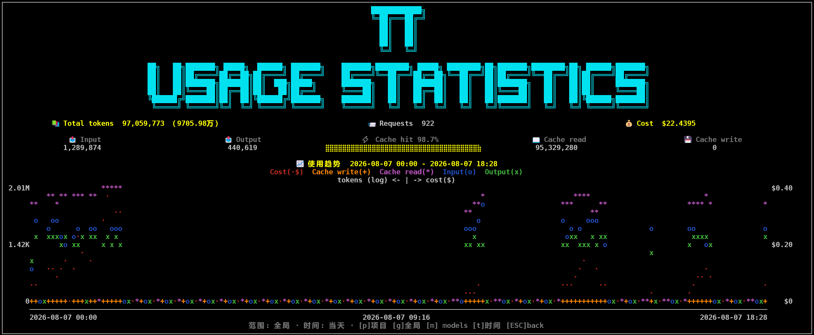
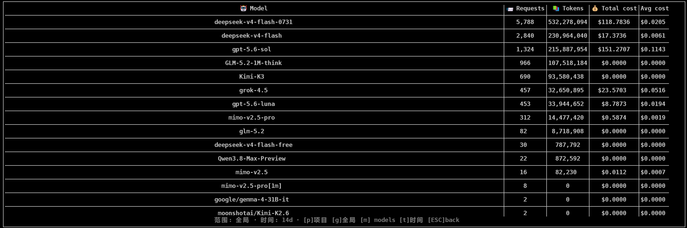

<div align="center">


</div>

# Pi Token Usage Statistics

> Track token usage, cost, and cache-hit statistics for the [Pi coding agent](https://github.com/earendil-works/pi) — with interactive TUI and Pi Web-compatible dashboards.

在 Pi 终端或 [Pi Web](https://github.com/agegr/pi-web) 中查看 token 使用统计：按 provider / 模型统计实际消耗，区分 input / output / cache 读写，计算缓存命中率与成本，支持项目级 / 全局级范围切换与多系列趋势曲线。**纯本地运行，不启动额外浏览器、不创建独立 HTTP 服务、无任何远程上报。**

本项目链接认可 [LINUX DO](https://linux.do) 社区。

<p align="center">
  
</p>

<p align="center">
  
</p>

## Features / 功能

- **Accurate collection** — 每条完成的 assistant 回复只计一次；不订阅 streaming 增量，避免双计
- **Aggregates across all local Pi sessions** — 总 tokens、请求数、成本、input / output / cache-create / cache-hit 与命中率
- **TUI + Pi Web dashboard** — `/pi-usage-statistics` 在 Pi 终端和 Pi Web 中打开同一个交互式统计面板

  | Key / 按键 | Action / 作用 |
  | --- | --- |
  | `p` / `g` | 切换项目 / 全局范围 |
  | `m` | 切换主视图 ↔ 按模型统计表 |
  | `t` | 循环时间范围：当天 → 1d → 7d → 14d → 30d → 1year → 全部 |
  | `Esc` | 返回（模型表 → 主视图）或关闭 |
  | `Ctrl+C` / Pi Web「关闭」 | 直接关闭面板 |

- **Standalone viewer / 独立查看器** — 安装本包后可直接运行 `pi-usage`（或 PowerShell wrapper `pi usage`）：不启动 pi 会话、不产生会话记录，htop 式打开同一面板（交互与上表一致），`Esc` 退出即回到终端（详见 [Terminal Quick Access](#terminal-quick-access--终端快速入口)）

- **Multi-series trends** — 同屏叠加 Cost / Cache write / Cache read / Input / Output 五条序列
- **Live updates / 实时刷新（秒级）** — 仪表盘打开期间双通道自动更新：成功的 `message_end` 先立即更新当前窗口内存，并异步持久化到共享 `records.jsonl`（连续消息会合并写入），本会话约 300ms 防抖刷新；**多窗口场景**每 0.5s 检测共享文件变化（变更后约 1 秒内自动重载上屏，另有每 5s 一次的强制校准兜底），其他仍在运行的 Pi 窗口产生的数据无需退出、重启或重新执行命令即可看到
- **Cost traceability** — 优先使用 Pi 记录的 `cost`；否则按内置价表估算；无价格时显示 `--`（面板上不再标注 `~` / estimated 后缀，估算状态暂不出现在 TUI）

## Requirements / 环境要求

- [Pi coding agent](https://github.com/earendil-works/pi) `>= 0.84.0`
- [Pi Web](https://github.com/agegr/pi-web) `>= 0.8.8`（仅使用 Web UI 时需要）
- Node.js `>= 22.19.0`

## Installation / 安装

任选一种方式安装。Pi 终端需要重启会话；Pi Web 可在插件面板安装后重载当前会话，或重启 `pi-web`。可用 `pi list` 查看已装扩展，`pi config` 启用 / 禁用。

### 推荐：从 npm 安装

```bash
pi install npm:pi-token-usage-statistics
```

需要独立查看器 `pi-usage`（终端快速入口）时，再全局安装 CLI（可选）：

```bash
npm install -g pi-token-usage-statistics
```

### 从 GitHub 安装

```bash
pi install git:github.com/Techd81/pi-usage-statistics
```

### 本地路径（开发 / 调试）

```bash
# Windows 示例
pi install D:/pi-usage-statistics

# macOS / Linux 示例
pi install /path/to/pi-usage-statistics
```

> 包名是 `pi-token-usage-statistics`（npm registry 已发布 0.2.0）；仓库名是 `pi-usage-statistics`。

安装成功后，在任意 Pi 会话中输入：

```text
/pi-usage-statistics
```

即可打开仪表盘。

### Pi Web

Pi Web `0.8.8+` 会在 RPC 会话中加载同一扩展，并把 `ctx.ui.custom()` 组件桥接为浏览器内的交互式面板。安装或启用插件后，在 Pi Web 会话输入相同命令即可：

```text
/pi-usage-statistics
```

面板支持 `p` / `g` / `m` / `t` / `Esc`，也可点击右上角「关闭」。Web 模式使用独立的 ASCII-safe 摘要、模型表和趋势图，避免 Emoji、Unicode 框线与浏览器字体度量差异造成列错位；终端 TUI 继续保留完整艺术字与多系列图表。统计、去重、价格计算、持久化和实时刷新全部复用插件现有实现；无需修改 Pi Web、无需额外端口，也不会启动第二个 Web 服务。

## Usage / 使用

在 Pi 终端或 Pi Web 会话中：

```text
/pi-usage-statistics           # 打开交互式面板（默认全局范围）
/pi-usage-statistics project   # 仅当前工作目录下的会话
/pi-usage-statistics global    # 全部本地会话
/pi-usage-statistics refresh   # 强制重扫 session 文件并打印摘要
```

- **Project scope**：只统计当前工作目录下的 session
- **Global scope**：扫描 `~/.pi/agent/sessions/` 下发现的全部会话

非交互模式（`print` / `json`）下命令只输出纯文本摘要，不会打开 TUI。

### 仪表盘操作速查

1. 打开后默认看到 **总览 + 趋势图**（如 `images/image1.png`）
2. 按 `m` 进入 **按模型统计表**（如 `images/image2.png`）：Model / Requests / Tokens / Total cost / Avg cost
3. 按 `t` 切换时间窗；按 `p` / `g` 切换项目 / 全局
4. **实时刷新（秒级）**：会话继续产生新回复时，记录会在 Pi 仍运行期间异步写入共享索引，界面自动更新（约 300ms 防抖）；其他 Pi 窗口的新增记录由约 0.5s 轮询自动检测并重载上屏（正常路径约 1 秒内显示），无需按键、无需退出重启
5. 按 `Esc` 退出（在模型表时先回到主视图）

## Terminal Quick Access / 终端快速入口

不想先进 pi 会话？安装本包后可直接运行独立统计查看器 `pi-usage`——htop 式 TUI，**不启动 pi 会话、不产生任何会话记录、无 LLM 调用**，按 `Esc` 退出后彻底回到终端。默认 global scope，面板内按 `p` / `g` 可切换项目 / 全局。

### `pi-usage`（独立查看器 bin）

```bash
pi-usage           # 默认 global scope（全部本地会话）
pi-usage project   # 当前工作目录 scope（records of process.cwd()）
```

- 数据源与 pi 扩展共享同一份持久化数据（`<agent-dir>/token-usage-statistics/records.jsonl`），只读加载，不扫描 session 文件
- 交互与 `/pi-usage-statistics` 面板完全一致：`p` / `g` 切换项目 / 全局、`m` 模型视图、`t` 时间范围、`Esc` 退出
- **热更新**：查看器每 0.5s 轮询记录文件，其他窗口的 pi 会话产生新记录后约 1s 内刷新上屏
- 非交互终端（管道 / CI）自动打印文本摘要后退出，不会挂起
- 终端处理：备用屏 + 隐藏光标 + raw mode；`Esc` / `Ctrl+C` 退出时完整还原（备用屏、光标、raw mode）

### `pi usage`（shell wrapper，可选）

pi CLI 将位置参数一律当作消息处理，因此字面 `pi usage` 需要由 shell 层转发到独立查看器 `pi-usage`。运行一键安装脚本（幂等，可重复执行；重复运行始终收敛为单份最新 wrapper，绝不重复）：

**Windows（PowerShell）**：

```powershell
powershell -ExecutionPolicy Bypass -File scripts/install-pi-usage.ps1
```

**macOS / Linux（bash / zsh）**：

```bash
bash scripts/install-pi-usage.sh            # 自动检测 $SHELL（bash → ~/.bashrc，zsh → ~/.zshrc）
bash scripts/install-pi-usage.sh --shell zsh # 或显式指定 rc 文件
bash scripts/install-pi-usage.sh --uninstall # 卸载
```

脚本安装的 `pi` wrapper 函数：

- `pi usage [args...]` → 转发为 `pi-usage [args...]`（等价于直接运行 `pi-usage` 独立查看器，子进程方式运行，不替换当前 shell）
- `pi` 的其他用法（`pi -c`、`pi --help`、`pi install ...` 等）原样透传，行为不变

wrapper 在新开的 shell 会话中生效（或先执行 `. $PROFILE` / `source ~/.bashrc`）。**前提**：已安装本包（`npm i -g pi-token-usage-statistics`，提供 `pi-usage` bin），并安装 pi 扩展以产生统计数据（`pi install git:github.com/Techd81/pi-usage-statistics`）。

## Data & Privacy / 数据与隐私

- 数据仅存本地：`<agent-dir>/token-usage-statistics/`（`records.jsonl` + `index.json`）
- 权威数据源是 Pi 自己的 session 文件（JSONL）；本扩展的索引只是可重建的加速缓存
- **无网络请求**：无服务器、无 CDN、无遥测
- 后台扫描在 session 启动时 debounce + single-flight 执行；成功的 `message_end` 记录会在活动会话期间异步落盘，跨窗口轮询据此同步；写盘/扫描失败时保留可用内存并在后续机会重试，成功时静默，失败才通知，不打扰正常对话

## Cost Estimation & Price Overrides / 成本估算与价格覆盖

成本优先级：

1. **Recorded** — Pi 自带的 `cost` 字段（校验通过后直接使用；全零占位视为非权威，价表可估算时回退为 Estimated）
2. **Estimated** — 内置价表或本地覆盖价表估算；面板显示为 `$x.xxxx`（不再带 `~` / `(estimated)` 后缀）
3. **Unavailable** — 无价格时为 `--`；token 统计不受影响

### 价格覆盖文件

在数据目录放置 `pricing.json`（与 `records.jsonl` 同目录）：

```json
{
  "schemaVersion": 1,
  "currency": "USD",
  "rows": [
    {
      "provider": "anthropic",
      "model": "claude-sonnet-4-5",
      "inputPer1k": 0.003,
      "outputPer1k": 0.015,
      "cacheReadPer1k": 0.0003,
      "cacheWritePer1k": 0.00375
    },
    {
      "provider": "my-provider",
      "model": "*",
      "inputPer1k": 0.001,
      "outputPer1k": 0.002,
      "cacheReadPer1k": 0.0001,
      "cacheWritePer1k": 0.0005
    }
  ]
}
```

- 字段名必须是 `schemaVersion`（不是 `version`）
- `model` / `provider` 支持 `*` 通配
- 价格单位：USD / 1k tokens
- 覆盖表与内置表合并，覆盖优先；文件非法时整文件忽略，不影响内置表

典型路径：

```bash
# macOS / Linux
~/.pi/agent/token-usage-statistics/pricing.json

# Windows
%USERPROFILE%\.pi\agent\token-usage-statistics\pricing.json
```

写入或修改后，重启 Pi 或执行 `/pi-usage-statistics refresh` 生效。

## Index Rebuild / Reset / 索引重建

删除数据目录后，下次启动会从 session 文件重建索引：

```bash
# macOS / Linux
rm -rf ~/.pi/agent/token-usage-statistics

# Windows (PowerShell)
Remove-Item -Recurse -Force "$env:USERPROFILE\.pi\agent\token-usage-statistics"
```

重建是非致命的：损坏的 session 文件会被跳过并计数，不会拖垮 Pi。

## Performance / 性能

- 查询路径纯内存聚合；5 万条记录量级下 today / all（含趋势）查询目标 &lt; 50ms
- 后台扫描 debounce（默认 1s）+ single-flight，避免与正常对话抢占
- 不挂文件 watcher、不开 HTTP、不在 extension factory 阶段做全量扫描

## Development / 开发

```bash
npm install
npm test           # 完整测试套件（vitest）
npm run typecheck  # 类型检查
npm pack --dry-run # 预览发包内容
npm publish        # 发布到 npm registry（需已登录并通过 2FA）
```

## Troubleshooting / 排查

| 现象 | 处理 |
| --- | --- |
| 命令找不到 | 确认已 `pi install` 且重启 Pi；`pi list` 中扩展已启用 |
| 数据为空 | 先正常对话产生 assistant 回复，或执行 `/pi-usage-statistics refresh` |
| 成本显示 `--` | 模型不在价表中；可配置 `pricing.json`，或依赖 Pi 写入的 recorded cost |
| 想强制重算 | 删除 `token-usage-statistics` 目录后重启 / refresh |

## License

MIT — see [LICENSE](LICENSE).
